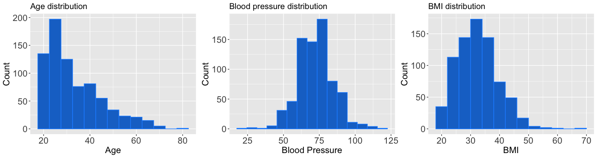

Logistic Regression in R - Diabetes
================
Melvin Galera
2024-03-24

- [I. Overview](#i-overview)
- [II. Objective](#ii-objective)
- [III. Data](#iii-data)
- [III. Exploratory Analysis](#iii-exploratory-analysis)
  - [A. Univariate Analysis](#a-univariate-analysis)
  - [Bivariate Distribution](#bivariate-distribution)
- [Data preparation](#data-preparation)
- [IV. Fitting and Evaluation of Linear
  Model](#iv-fitting-and-evaluation-of-linear-model)
  - [Splitting the dataset](#splitting-the-dataset)
  - [Diagnostics](#diagnostics)
  - [Just checking - excluding Insulin and skin thickness
    columns](#just-checking---excluding-insulin-and-skin-thickness-columns)
  - [ROC Curve and AUC](#roc-curve-and-auc)
  - [Check Model 1 results](#check-model-1-results)
  - [ROC Curve and AUC for Model 01B and
    02B](#roc-curve-and-auc-for-model-01b-and-02b)

------------------------------------------------------------------------

## I. Overview

The dataset has 768 observations and 9 variables:

- `Pregnancies` : number of pregnancies a woman has had, including live
  birth, miscarriage, or stillbirth
- `Glucose` : level of plasma glucose concentration
- `BloodPressure` : blood pressure
- `SkinThickness` : thickness of skinfold
- `Insulin` : level of insulin
- `BMI` : body mass index
- `DiabetesPedigreeFunction` : risk of developing type 2 diabetes
- `Age` : age
- `Outcome` : diabetic patient or not

## II. Objective

The objective is to develop a predictive model (in terms of odds) for
medical cost using GLM- logistic regression based on the given predictor
variables.

## III. Data

Initial look at the structure and content of `diabetes_df` dataset:

``` r
str(diabetes_df)
```

    ## 'data.frame':    768 obs. of  9 variables:
    ##  $ Pregnancies             : int  6 1 8 1 0 5 3 10 2 8 ...
    ##  $ Glucose                 : int  148 85 183 89 137 116 78 115 197 125 ...
    ##  $ BloodPressure           : int  72 66 64 66 40 74 50 0 70 96 ...
    ##  $ SkinThickness           : int  35 29 0 23 35 0 32 0 45 0 ...
    ##  $ Insulin                 : int  0 0 0 94 168 0 88 0 543 0 ...
    ##  $ BMI                     : num  33.6 26.6 23.3 28.1 43.1 25.6 31 35.3 30.5 0 ...
    ##  $ DiabetesPedigreeFunction: num  0.627 0.351 0.672 0.167 2.288 ...
    ##  $ Age                     : int  50 31 32 21 33 30 26 29 53 54 ...
    ##  $ Outcome                 : int  1 0 1 0 1 0 1 0 1 1 ...

``` r
diabetes_df %>% head(10)
```

    ##    Pregnancies Glucose BloodPressure SkinThickness Insulin  BMI
    ## 1            6     148            72            35       0 33.6
    ## 2            1      85            66            29       0 26.6
    ## 3            8     183            64             0       0 23.3
    ## 4            1      89            66            23      94 28.1
    ## 5            0     137            40            35     168 43.1
    ## 6            5     116            74             0       0 25.6
    ## 7            3      78            50            32      88 31.0
    ## 8           10     115             0             0       0 35.3
    ## 9            2     197            70            45     543 30.5
    ## 10           8     125            96             0       0  0.0
    ##    DiabetesPedigreeFunction Age Outcome
    ## 1                     0.627  50       1
    ## 2                     0.351  31       0
    ## 3                     0.672  32       1
    ## 4                     0.167  21       0
    ## 5                     2.288  33       1
    ## 6                     0.201  30       0
    ## 7                     0.248  26       1
    ## 8                     0.134  29       0
    ## 9                     0.158  53       1
    ## 10                    0.232  54       1

## III. Exploratory Analysis

To perform EDA on the dataset, we perform univariate distribution of the
variables and the bivariate and multivariate relationships among the
variables.

### A. Univariate Analysis

Summary statistics

    ##   Pregnancies        Glucose      BloodPressure    SkinThickness  
    ##  Min.   : 0.000   Min.   :  0.0   Min.   :  0.00   Min.   : 0.00  
    ##  1st Qu.: 1.000   1st Qu.: 99.0   1st Qu.: 62.00   1st Qu.: 0.00  
    ##  Median : 3.000   Median :117.0   Median : 72.00   Median :23.00  
    ##  Mean   : 3.845   Mean   :120.9   Mean   : 69.11   Mean   :20.54  
    ##  3rd Qu.: 6.000   3rd Qu.:140.2   3rd Qu.: 80.00   3rd Qu.:32.00  
    ##  Max.   :17.000   Max.   :199.0   Max.   :122.00   Max.   :99.00  
    ##     Insulin           BMI        DiabetesPedigreeFunction      Age       
    ##  Min.   :  0.0   Min.   : 0.00   Min.   :0.0780           Min.   :21.00  
    ##  1st Qu.:  0.0   1st Qu.:27.30   1st Qu.:0.2437           1st Qu.:24.00  
    ##  Median : 30.5   Median :32.00   Median :0.3725           Median :29.00  
    ##  Mean   : 79.8   Mean   :31.99   Mean   :0.4719           Mean   :33.24  
    ##  3rd Qu.:127.2   3rd Qu.:36.60   3rd Qu.:0.6262           3rd Qu.:41.00  
    ##  Max.   :846.0   Max.   :67.10   Max.   :2.4200           Max.   :81.00  
    ##     Outcome     
    ##  Min.   :0.000  
    ##  1st Qu.:0.000  
    ##  Median :0.000  
    ##  Mean   :0.349  
    ##  3rd Qu.:1.000  
    ##  Max.   :1.000

Questionable values: Minimum value for glucose, BP, skin thickness,
insulin and BMI is zero which is not realistic. Change the zero values
to NA.

    ##              Pregnancies                  Glucose            BloodPressure 
    ##                        0                        5                       35 
    ##            SkinThickness                  Insulin                      BMI 
    ##                      227                      374                       11 
    ## DiabetesPedigreeFunction                      Age                  Outcome 
    ##                        0                        0                        0

    ##   Pregnancies        Glucose      BloodPressure    SkinThickness  
    ##  Min.   : 0.000   Min.   : 44.0   Min.   : 24.00   Min.   : 7.00  
    ##  1st Qu.: 1.000   1st Qu.: 99.0   1st Qu.: 64.00   1st Qu.:22.00  
    ##  Median : 3.000   Median :117.0   Median : 72.00   Median :29.00  
    ##  Mean   : 3.845   Mean   :121.7   Mean   : 72.41   Mean   :29.15  
    ##  3rd Qu.: 6.000   3rd Qu.:141.0   3rd Qu.: 80.00   3rd Qu.:36.00  
    ##  Max.   :17.000   Max.   :199.0   Max.   :122.00   Max.   :99.00  
    ##                   NA's   :5       NA's   :35       NA's   :227    
    ##     Insulin            BMI        DiabetesPedigreeFunction      Age       
    ##  Min.   : 14.00   Min.   :18.20   Min.   :0.0780           Min.   :21.00  
    ##  1st Qu.: 76.25   1st Qu.:27.50   1st Qu.:0.2437           1st Qu.:24.00  
    ##  Median :125.00   Median :32.30   Median :0.3725           Median :29.00  
    ##  Mean   :155.55   Mean   :32.46   Mean   :0.4719           Mean   :33.24  
    ##  3rd Qu.:190.00   3rd Qu.:36.60   3rd Qu.:0.6262           3rd Qu.:41.00  
    ##  Max.   :846.00   Max.   :67.10   Max.   :2.4200           Max.   :81.00  
    ##  NA's   :374      NA's   :11                                              
    ##  Outcome
    ##  0:500  
    ##  1:268  
    ##         
    ##         
    ##         
    ##         
    ## 

Univariate Plots


### Bivariate Distribution


Correlation Plot



## Data preparation

    ##              Pregnancies                  Glucose            BloodPressure 
    ##                        0                        5                       35 
    ##            SkinThickness                  Insulin                      BMI 
    ##                      227                      374                       11 
    ## DiabetesPedigreeFunction                      Age                  Outcome 
    ##                        0                        0                        0

Imputation using mean

    ##              Pregnancies                  Glucose            BloodPressure 
    ##                        0                        0                        0 
    ##            SkinThickness                  Insulin                      BMI 
    ##                        0                        0                        0 
    ## DiabetesPedigreeFunction                      Age                  Outcome 
    ##                        0                        0                        0

    ##   Pregnancies        Glucose       BloodPressure    SkinThickness  
    ##  Min.   : 0.000   Min.   : 44.00   Min.   : 24.00   Min.   : 7.00  
    ##  1st Qu.: 1.000   1st Qu.: 99.75   1st Qu.: 64.00   1st Qu.:20.54  
    ##  Median : 3.000   Median :117.00   Median : 72.00   Median :23.00  
    ##  Mean   : 3.845   Mean   :121.68   Mean   : 72.25   Mean   :26.61  
    ##  3rd Qu.: 6.000   3rd Qu.:140.25   3rd Qu.: 80.00   3rd Qu.:32.00  
    ##  Max.   :17.000   Max.   :199.00   Max.   :122.00   Max.   :99.00  
    ##     Insulin            BMI        DiabetesPedigreeFunction      Age       
    ##  Min.   : 14.00   Min.   :18.20   Min.   :0.0780           Min.   :21.00  
    ##  1st Qu.: 26.61   1st Qu.:27.50   1st Qu.:0.2437           1st Qu.:24.00  
    ##  Median : 30.50   Median :32.00   Median :0.3725           Median :29.00  
    ##  Mean   : 92.76   Mean   :32.45   Mean   :0.4719           Mean   :33.24  
    ##  3rd Qu.:127.25   3rd Qu.:36.60   3rd Qu.:0.6262           3rd Qu.:41.00  
    ##  Max.   :846.00   Max.   :67.10   Max.   :2.4200           Max.   :81.00  
    ##  Outcome
    ##  0:500  
    ##  1:268  
    ##         
    ##         
    ##         
    ## 


## IV. Fitting and Evaluation of Linear Model

### Splitting the dataset

Split the dataset: 80% training data and 20% test data

    ## [1] 614

    ## [1] 154

Model 1: Logistic regression model

``` r
diabetes_logmod_01 <- glm(Outcome~ Age + BloodPressure + BMI + 
                       DiabetesPedigreeFunction + Insulin + Glucose + SkinThickness + Pregnancies, 
                       family = binomial(link = 'logit'), data = training_data)
```

    ## 
    ## Call:
    ## glm(formula = Outcome ~ Age + BloodPressure + BMI + DiabetesPedigreeFunction + 
    ##     Insulin + Glucose + SkinThickness + Pregnancies, family = binomial(link = "logit"), 
    ##     data = training_data)
    ## 
    ## Coefficients:
    ##                            Estimate Std. Error z value Pr(>|z|)    
    ## (Intercept)              -10.126487   0.955690 -10.596  < 2e-16 ***
    ## Age                        0.005600   0.011015   0.508 0.611204    
    ## BloodPressure             -0.002117   0.010147  -0.209 0.834746    
    ## BMI                        0.095238   0.020360   4.678  2.9e-06 ***
    ## DiabetesPedigreeFunction   1.418933   0.366964   3.867 0.000110 ***
    ## Insulin                   -0.002281   0.001027  -2.221 0.026319 *  
    ## Glucose                    0.043283   0.004610   9.388  < 2e-16 ***
    ## SkinThickness             -0.001220   0.013002  -0.094 0.925212    
    ## Pregnancies                0.127910   0.037843   3.380 0.000725 ***
    ## ---
    ## Signif. codes:  0 '***' 0.001 '**' 0.01 '*' 0.05 '.' 0.1 ' ' 1
    ## 
    ## (Dispersion parameter for binomial family taken to be 1)
    ## 
    ##     Null deviance: 798.83  on 613  degrees of freedom
    ## Residual deviance: 546.67  on 605  degrees of freedom
    ## AIC: 564.67
    ## 
    ## Number of Fisher Scoring iterations: 5

<table style="border-collapse:collapse; border:none;">
<tr>
<th style="border-top: double; text-align:center; font-style:normal; font-weight:bold; padding:0.2cm;  text-align:left; ">
 
</th>
<th colspan="3" style="border-top: double; text-align:center; font-style:normal; font-weight:bold; padding:0.2cm; ">
Outcome
</th>
</tr>
<tr>
<td style=" text-align:center; border-bottom:1px solid; font-style:italic; font-weight:normal;  text-align:left; ">
Predictors
</td>
<td style=" text-align:center; border-bottom:1px solid; font-style:italic; font-weight:normal;  ">
Odds Ratios
</td>
<td style=" text-align:center; border-bottom:1px solid; font-style:italic; font-weight:normal;  ">
CI
</td>
<td style=" text-align:center; border-bottom:1px solid; font-style:italic; font-weight:normal;  ">
p
</td>
</tr>
<tr>
<td style=" padding:0.2cm; text-align:left; vertical-align:top; text-align:left; ">
(Intercept)
</td>
<td style=" padding:0.2cm; text-align:left; vertical-align:top; text-align:center;  ">
0.00
</td>
<td style=" padding:0.2cm; text-align:left; vertical-align:top; text-align:center;  ">
0.00 – 0.00
</td>
<td style=" padding:0.2cm; text-align:left; vertical-align:top; text-align:center;  ">
<strong>\<0.001</strong>
</td>
</tr>
<tr>
<td style=" padding:0.2cm; text-align:left; vertical-align:top; text-align:left; ">
Age
</td>
<td style=" padding:0.2cm; text-align:left; vertical-align:top; text-align:center;  ">
1.01
</td>
<td style=" padding:0.2cm; text-align:left; vertical-align:top; text-align:center;  ">
0.98 – 1.03
</td>
<td style=" padding:0.2cm; text-align:left; vertical-align:top; text-align:center;  ">
0.611
</td>
</tr>
<tr>
<td style=" padding:0.2cm; text-align:left; vertical-align:top; text-align:left; ">
BloodPressure
</td>
<td style=" padding:0.2cm; text-align:left; vertical-align:top; text-align:center;  ">
1.00
</td>
<td style=" padding:0.2cm; text-align:left; vertical-align:top; text-align:center;  ">
0.98 – 1.02
</td>
<td style=" padding:0.2cm; text-align:left; vertical-align:top; text-align:center;  ">
0.835
</td>
</tr>
<tr>
<td style=" padding:0.2cm; text-align:left; vertical-align:top; text-align:left; ">
BMI
</td>
<td style=" padding:0.2cm; text-align:left; vertical-align:top; text-align:center;  ">
1.10
</td>
<td style=" padding:0.2cm; text-align:left; vertical-align:top; text-align:center;  ">
1.06 – 1.15
</td>
<td style=" padding:0.2cm; text-align:left; vertical-align:top; text-align:center;  ">
<strong>\<0.001</strong>
</td>
</tr>
<tr>
<td style=" padding:0.2cm; text-align:left; vertical-align:top; text-align:left; ">
DiabetesPedigreeFunction
</td>
<td style=" padding:0.2cm; text-align:left; vertical-align:top; text-align:center;  ">
4.13
</td>
<td style=" padding:0.2cm; text-align:left; vertical-align:top; text-align:center;  ">
2.03 – 8.56
</td>
<td style=" padding:0.2cm; text-align:left; vertical-align:top; text-align:center;  ">
<strong>\<0.001</strong>
</td>
</tr>
<tr>
<td style=" padding:0.2cm; text-align:left; vertical-align:top; text-align:left; ">
Insulin
</td>
<td style=" padding:0.2cm; text-align:left; vertical-align:top; text-align:center;  ">
1.00
</td>
<td style=" padding:0.2cm; text-align:left; vertical-align:top; text-align:center;  ">
1.00 – 1.00
</td>
<td style=" padding:0.2cm; text-align:left; vertical-align:top; text-align:center;  ">
<strong>0.026</strong>
</td>
</tr>
<tr>
<td style=" padding:0.2cm; text-align:left; vertical-align:top; text-align:left; ">
Glucose
</td>
<td style=" padding:0.2cm; text-align:left; vertical-align:top; text-align:center;  ">
1.04
</td>
<td style=" padding:0.2cm; text-align:left; vertical-align:top; text-align:center;  ">
1.04 – 1.05
</td>
<td style=" padding:0.2cm; text-align:left; vertical-align:top; text-align:center;  ">
<strong>\<0.001</strong>
</td>
</tr>
<tr>
<td style=" padding:0.2cm; text-align:left; vertical-align:top; text-align:left; ">
SkinThickness
</td>
<td style=" padding:0.2cm; text-align:left; vertical-align:top; text-align:center;  ">
1.00
</td>
<td style=" padding:0.2cm; text-align:left; vertical-align:top; text-align:center;  ">
0.97 – 1.02
</td>
<td style=" padding:0.2cm; text-align:left; vertical-align:top; text-align:center;  ">
0.925
</td>
</tr>
<tr>
<td style=" padding:0.2cm; text-align:left; vertical-align:top; text-align:left; ">
Pregnancies
</td>
<td style=" padding:0.2cm; text-align:left; vertical-align:top; text-align:center;  ">
1.14
</td>
<td style=" padding:0.2cm; text-align:left; vertical-align:top; text-align:center;  ">
1.06 – 1.23
</td>
<td style=" padding:0.2cm; text-align:left; vertical-align:top; text-align:center;  ">
<strong>0.001</strong>
</td>
</tr>
<tr>
<td style=" padding:0.2cm; text-align:left; vertical-align:top; text-align:left; padding-top:0.1cm; padding-bottom:0.1cm; border-top:1px solid;">
Observations
</td>
<td style=" padding:0.2cm; text-align:left; vertical-align:top; padding-top:0.1cm; padding-bottom:0.1cm; text-align:left; border-top:1px solid;" colspan="3">
614
</td>
</tr>
</table>

B. Improving the model

Model 2 - Check for non-linear association with outcome and age

``` r
diabetes_logmod_02 <- glm(Outcome~ Age +  I(Age^2) + BloodPressure + BMI + 
                       DiabetesPedigreeFunction + Insulin + Glucose + SkinThickness + Pregnancies, 
                       family = binomial(link = 'logit'), data = training_data)
```

    ## 
    ## Call:
    ## glm(formula = Outcome ~ Age + I(Age^2) + BloodPressure + BMI + 
    ##     DiabetesPedigreeFunction + Insulin + Glucose + SkinThickness + 
    ##     Pregnancies, family = binomial(link = "logit"), data = training_data)
    ## 
    ## Coefficients:
    ##                            Estimate Std. Error z value Pr(>|z|)    
    ## (Intercept)              -1.511e+01  1.558e+00  -9.699  < 2e-16 ***
    ## Age                       3.095e-01  6.987e-02   4.430 9.41e-06 ***
    ## I(Age^2)                 -3.573e-03  8.233e-04  -4.340 1.43e-05 ***
    ## BloodPressure            -5.446e-03  1.030e-02  -0.529 0.596887    
    ## BMI                       9.073e-02  2.055e-02   4.416 1.01e-05 ***
    ## DiabetesPedigreeFunction  1.410e+00  3.683e-01   3.829 0.000129 ***
    ## Insulin                  -2.351e-03  1.034e-03  -2.272 0.023064 *  
    ## Glucose                   4.434e-02  4.740e-03   9.356  < 2e-16 ***
    ## SkinThickness            -5.804e-03  1.311e-02  -0.443 0.658038    
    ## Pregnancies               4.460e-02  4.183e-02   1.066 0.286359    
    ## ---
    ## Signif. codes:  0 '***' 0.001 '**' 0.01 '*' 0.05 '.' 0.1 ' ' 1
    ## 
    ## (Dispersion parameter for binomial family taken to be 1)
    ## 
    ##     Null deviance: 798.83  on 613  degrees of freedom
    ## Residual deviance: 524.94  on 604  degrees of freedom
    ## AIC: 544.94
    ## 
    ## Number of Fisher Scoring iterations: 5

<table style="border-collapse:collapse; border:none;">
<tr>
<th style="border-top: double; text-align:center; font-style:normal; font-weight:bold; padding:0.2cm;  text-align:left; ">
 
</th>
<th colspan="3" style="border-top: double; text-align:center; font-style:normal; font-weight:bold; padding:0.2cm; ">
Outcome
</th>
</tr>
<tr>
<td style=" text-align:center; border-bottom:1px solid; font-style:italic; font-weight:normal;  text-align:left; ">
Predictors
</td>
<td style=" text-align:center; border-bottom:1px solid; font-style:italic; font-weight:normal;  ">
Odds Ratios
</td>
<td style=" text-align:center; border-bottom:1px solid; font-style:italic; font-weight:normal;  ">
CI
</td>
<td style=" text-align:center; border-bottom:1px solid; font-style:italic; font-weight:normal;  ">
p
</td>
</tr>
<tr>
<td style=" padding:0.2cm; text-align:left; vertical-align:top; text-align:left; ">
(Intercept)
</td>
<td style=" padding:0.2cm; text-align:left; vertical-align:top; text-align:center;  ">
0.00
</td>
<td style=" padding:0.2cm; text-align:left; vertical-align:top; text-align:center;  ">
0.00 – 0.00
</td>
<td style=" padding:0.2cm; text-align:left; vertical-align:top; text-align:center;  ">
<strong>\<0.001</strong>
</td>
</tr>
<tr>
<td style=" padding:0.2cm; text-align:left; vertical-align:top; text-align:left; ">
Age
</td>
<td style=" padding:0.2cm; text-align:left; vertical-align:top; text-align:center;  ">
1.36
</td>
<td style=" padding:0.2cm; text-align:left; vertical-align:top; text-align:center;  ">
1.19 – 1.57
</td>
<td style=" padding:0.2cm; text-align:left; vertical-align:top; text-align:center;  ">
<strong>\<0.001</strong>
</td>
</tr>
<tr>
<td style=" padding:0.2cm; text-align:left; vertical-align:top; text-align:left; ">
Age^2
</td>
<td style=" padding:0.2cm; text-align:left; vertical-align:top; text-align:center;  ">
1.00
</td>
<td style=" padding:0.2cm; text-align:left; vertical-align:top; text-align:center;  ">
0.99 – 1.00
</td>
<td style=" padding:0.2cm; text-align:left; vertical-align:top; text-align:center;  ">
<strong>\<0.001</strong>
</td>
</tr>
<tr>
<td style=" padding:0.2cm; text-align:left; vertical-align:top; text-align:left; ">
BloodPressure
</td>
<td style=" padding:0.2cm; text-align:left; vertical-align:top; text-align:center;  ">
0.99
</td>
<td style=" padding:0.2cm; text-align:left; vertical-align:top; text-align:center;  ">
0.97 – 1.01
</td>
<td style=" padding:0.2cm; text-align:left; vertical-align:top; text-align:center;  ">
0.597
</td>
</tr>
<tr>
<td style=" padding:0.2cm; text-align:left; vertical-align:top; text-align:left; ">
BMI
</td>
<td style=" padding:0.2cm; text-align:left; vertical-align:top; text-align:center;  ">
1.09
</td>
<td style=" padding:0.2cm; text-align:left; vertical-align:top; text-align:center;  ">
1.05 – 1.14
</td>
<td style=" padding:0.2cm; text-align:left; vertical-align:top; text-align:center;  ">
<strong>\<0.001</strong>
</td>
</tr>
<tr>
<td style=" padding:0.2cm; text-align:left; vertical-align:top; text-align:left; ">
DiabetesPedigreeFunction
</td>
<td style=" padding:0.2cm; text-align:left; vertical-align:top; text-align:center;  ">
4.10
</td>
<td style=" padding:0.2cm; text-align:left; vertical-align:top; text-align:center;  ">
2.01 – 8.52
</td>
<td style=" padding:0.2cm; text-align:left; vertical-align:top; text-align:center;  ">
<strong>\<0.001</strong>
</td>
</tr>
<tr>
<td style=" padding:0.2cm; text-align:left; vertical-align:top; text-align:left; ">
Insulin
</td>
<td style=" padding:0.2cm; text-align:left; vertical-align:top; text-align:center;  ">
1.00
</td>
<td style=" padding:0.2cm; text-align:left; vertical-align:top; text-align:center;  ">
1.00 – 1.00
</td>
<td style=" padding:0.2cm; text-align:left; vertical-align:top; text-align:center;  ">
<strong>0.023</strong>
</td>
</tr>
<tr>
<td style=" padding:0.2cm; text-align:left; vertical-align:top; text-align:left; ">
Glucose
</td>
<td style=" padding:0.2cm; text-align:left; vertical-align:top; text-align:center;  ">
1.05
</td>
<td style=" padding:0.2cm; text-align:left; vertical-align:top; text-align:center;  ">
1.04 – 1.06
</td>
<td style=" padding:0.2cm; text-align:left; vertical-align:top; text-align:center;  ">
<strong>\<0.001</strong>
</td>
</tr>
<tr>
<td style=" padding:0.2cm; text-align:left; vertical-align:top; text-align:left; ">
SkinThickness
</td>
<td style=" padding:0.2cm; text-align:left; vertical-align:top; text-align:center;  ">
0.99
</td>
<td style=" padding:0.2cm; text-align:left; vertical-align:top; text-align:center;  ">
0.97 – 1.02
</td>
<td style=" padding:0.2cm; text-align:left; vertical-align:top; text-align:center;  ">
0.658
</td>
</tr>
<tr>
<td style=" padding:0.2cm; text-align:left; vertical-align:top; text-align:left; ">
Pregnancies
</td>
<td style=" padding:0.2cm; text-align:left; vertical-align:top; text-align:center;  ">
1.05
</td>
<td style=" padding:0.2cm; text-align:left; vertical-align:top; text-align:center;  ">
0.96 – 1.14
</td>
<td style=" padding:0.2cm; text-align:left; vertical-align:top; text-align:center;  ">
0.286
</td>
</tr>
<tr>
<td style=" padding:0.2cm; text-align:left; vertical-align:top; text-align:left; padding-top:0.1cm; padding-bottom:0.1cm; border-top:1px solid;">
Observations
</td>
<td style=" padding:0.2cm; text-align:left; vertical-align:top; padding-top:0.1cm; padding-bottom:0.1cm; text-align:left; border-top:1px solid;" colspan="3">
614
</td>
</tr>
</table>

COMPARISON OF MODEL 1 and MODEL 2 by analysis of deviance table

``` r
# compare model 1 and model 2
anova(diabetes_logmod_01, diabetes_logmod_02, test = "Chi")
```

    ## Analysis of Deviance Table
    ## 
    ## Model 1: Outcome ~ Age + BloodPressure + BMI + DiabetesPedigreeFunction + 
    ##     Insulin + Glucose + SkinThickness + Pregnancies
    ## Model 2: Outcome ~ Age + I(Age^2) + BloodPressure + BMI + DiabetesPedigreeFunction + 
    ##     Insulin + Glucose + SkinThickness + Pregnancies
    ##   Resid. Df Resid. Dev Df Deviance Pr(>Chi)    
    ## 1       605     546.67                         
    ## 2       604     524.94  1   21.729 3.14e-06 ***
    ## ---
    ## Signif. codes:  0 '***' 0.001 '**' 0.01 '*' 0.05 '.' 0.1 ' ' 1

Results: additional DF of 1 and a low p-value which means age2 is a
significant predictor (Model 2)

### Diagnostics


### Just checking - excluding Insulin and skin thickness columns

Model 1B: Logistic regression model

``` r
diabetes_logmod_01B <- glm(Outcome~ Age + BloodPressure + BMI + 
                       DiabetesPedigreeFunction + Glucose + Pregnancies, 
                       family = binomial(link = 'logit'), data = training_data)
```

    ## 
    ## Call:
    ## glm(formula = Outcome ~ Age + BloodPressure + BMI + DiabetesPedigreeFunction + 
    ##     Glucose + Pregnancies, family = binomial(link = "logit"), 
    ##     data = training_data)
    ## 
    ## Coefficients:
    ##                            Estimate Std. Error z value Pr(>|z|)    
    ## (Intercept)              -9.8765082  0.9383274 -10.526  < 2e-16 ***
    ## Age                       0.0069667  0.0109704   0.635 0.525401    
    ## BloodPressure             0.0003571  0.0100432   0.036 0.971636    
    ## BMI                       0.0877704  0.0178751   4.910  9.1e-07 ***
    ## DiabetesPedigreeFunction  1.3422850  0.3632407   3.695 0.000220 ***
    ## Glucose                   0.0395220  0.0041916   9.429  < 2e-16 ***
    ## Pregnancies               0.1318632  0.0373929   3.526 0.000421 ***
    ## ---
    ## Signif. codes:  0 '***' 0.001 '**' 0.01 '*' 0.05 '.' 0.1 ' ' 1
    ## 
    ## (Dispersion parameter for binomial family taken to be 1)
    ## 
    ##     Null deviance: 798.83  on 613  degrees of freedom
    ## Residual deviance: 552.00  on 607  degrees of freedom
    ## AIC: 566
    ## 
    ## Number of Fisher Scoring iterations: 5

<table style="border-collapse:collapse; border:none;">
<tr>
<th style="border-top: double; text-align:center; font-style:normal; font-weight:bold; padding:0.2cm;  text-align:left; ">
 
</th>
<th colspan="3" style="border-top: double; text-align:center; font-style:normal; font-weight:bold; padding:0.2cm; ">
Outcome
</th>
</tr>
<tr>
<td style=" text-align:center; border-bottom:1px solid; font-style:italic; font-weight:normal;  text-align:left; ">
Predictors
</td>
<td style=" text-align:center; border-bottom:1px solid; font-style:italic; font-weight:normal;  ">
Odds Ratios
</td>
<td style=" text-align:center; border-bottom:1px solid; font-style:italic; font-weight:normal;  ">
CI
</td>
<td style=" text-align:center; border-bottom:1px solid; font-style:italic; font-weight:normal;  ">
p
</td>
</tr>
<tr>
<td style=" padding:0.2cm; text-align:left; vertical-align:top; text-align:left; ">
(Intercept)
</td>
<td style=" padding:0.2cm; text-align:left; vertical-align:top; text-align:center;  ">
0.00
</td>
<td style=" padding:0.2cm; text-align:left; vertical-align:top; text-align:center;  ">
0.00 – 0.00
</td>
<td style=" padding:0.2cm; text-align:left; vertical-align:top; text-align:center;  ">
<strong>\<0.001</strong>
</td>
</tr>
<tr>
<td style=" padding:0.2cm; text-align:left; vertical-align:top; text-align:left; ">
Age
</td>
<td style=" padding:0.2cm; text-align:left; vertical-align:top; text-align:center;  ">
1.01
</td>
<td style=" padding:0.2cm; text-align:left; vertical-align:top; text-align:center;  ">
0.99 – 1.03
</td>
<td style=" padding:0.2cm; text-align:left; vertical-align:top; text-align:center;  ">
0.525
</td>
</tr>
<tr>
<td style=" padding:0.2cm; text-align:left; vertical-align:top; text-align:left; ">
BloodPressure
</td>
<td style=" padding:0.2cm; text-align:left; vertical-align:top; text-align:center;  ">
1.00
</td>
<td style=" padding:0.2cm; text-align:left; vertical-align:top; text-align:center;  ">
0.98 – 1.02
</td>
<td style=" padding:0.2cm; text-align:left; vertical-align:top; text-align:center;  ">
0.972
</td>
</tr>
<tr>
<td style=" padding:0.2cm; text-align:left; vertical-align:top; text-align:left; ">
BMI
</td>
<td style=" padding:0.2cm; text-align:left; vertical-align:top; text-align:center;  ">
1.09
</td>
<td style=" padding:0.2cm; text-align:left; vertical-align:top; text-align:center;  ">
1.05 – 1.13
</td>
<td style=" padding:0.2cm; text-align:left; vertical-align:top; text-align:center;  ">
<strong>\<0.001</strong>
</td>
</tr>
<tr>
<td style=" padding:0.2cm; text-align:left; vertical-align:top; text-align:left; ">
DiabetesPedigreeFunction
</td>
<td style=" padding:0.2cm; text-align:left; vertical-align:top; text-align:center;  ">
3.83
</td>
<td style=" padding:0.2cm; text-align:left; vertical-align:top; text-align:center;  ">
1.89 – 7.86
</td>
<td style=" padding:0.2cm; text-align:left; vertical-align:top; text-align:center;  ">
<strong>\<0.001</strong>
</td>
</tr>
<tr>
<td style=" padding:0.2cm; text-align:left; vertical-align:top; text-align:left; ">
Glucose
</td>
<td style=" padding:0.2cm; text-align:left; vertical-align:top; text-align:center;  ">
1.04
</td>
<td style=" padding:0.2cm; text-align:left; vertical-align:top; text-align:center;  ">
1.03 – 1.05
</td>
<td style=" padding:0.2cm; text-align:left; vertical-align:top; text-align:center;  ">
<strong>\<0.001</strong>
</td>
</tr>
<tr>
<td style=" padding:0.2cm; text-align:left; vertical-align:top; text-align:left; ">
Pregnancies
</td>
<td style=" padding:0.2cm; text-align:left; vertical-align:top; text-align:center;  ">
1.14
</td>
<td style=" padding:0.2cm; text-align:left; vertical-align:top; text-align:center;  ">
1.06 – 1.23
</td>
<td style=" padding:0.2cm; text-align:left; vertical-align:top; text-align:center;  ">
<strong>\<0.001</strong>
</td>
</tr>
<tr>
<td style=" padding:0.2cm; text-align:left; vertical-align:top; text-align:left; padding-top:0.1cm; padding-bottom:0.1cm; border-top:1px solid;">
Observations
</td>
<td style=" padding:0.2cm; text-align:left; vertical-align:top; padding-top:0.1cm; padding-bottom:0.1cm; text-align:left; border-top:1px solid;" colspan="3">
614
</td>
</tr>
</table>

B. Improving the model

Model 2B - Check for non-linear association with outcome and age

``` r
diabetes_logmod_02B <- glm(Outcome~ Age +  I(Age^2) + BloodPressure + BMI + 
                       DiabetesPedigreeFunction + Glucose + Pregnancies, 
                       family = binomial(link = 'logit'), data = training_data)
```

    ## 
    ## Call:
    ## glm(formula = Outcome ~ Age + I(Age^2) + BloodPressure + BMI + 
    ##     DiabetesPedigreeFunction + Glucose + Pregnancies, family = binomial(link = "logit"), 
    ##     data = training_data)
    ## 
    ## Coefficients:
    ##                            Estimate Std. Error z value Pr(>|z|)    
    ## (Intercept)              -1.473e+01  1.533e+00  -9.604  < 2e-16 ***
    ## Age                       3.036e-01  6.923e-02   4.385 1.16e-05 ***
    ## I(Age^2)                 -3.479e-03  8.145e-04  -4.272 1.94e-05 ***
    ## BloodPressure            -2.860e-03  1.017e-02  -0.281   0.7787    
    ## BMI                       8.004e-02  1.810e-02   4.422 9.78e-06 ***
    ## DiabetesPedigreeFunction  1.320e+00  3.650e-01   3.616   0.0003 ***
    ## Glucose                   4.025e-02  4.289e-03   9.384  < 2e-16 ***
    ## Pregnancies               5.029e-02  4.139e-02   1.215   0.2244    
    ## ---
    ## Signif. codes:  0 '***' 0.001 '**' 0.01 '*' 0.05 '.' 0.1 ' ' 1
    ## 
    ## (Dispersion parameter for binomial family taken to be 1)
    ## 
    ##     Null deviance: 798.83  on 613  degrees of freedom
    ## Residual deviance: 530.93  on 606  degrees of freedom
    ## AIC: 546.93
    ## 
    ## Number of Fisher Scoring iterations: 5

<table style="border-collapse:collapse; border:none;">
<tr>
<th style="border-top: double; text-align:center; font-style:normal; font-weight:bold; padding:0.2cm;  text-align:left; ">
 
</th>
<th colspan="3" style="border-top: double; text-align:center; font-style:normal; font-weight:bold; padding:0.2cm; ">
Outcome
</th>
</tr>
<tr>
<td style=" text-align:center; border-bottom:1px solid; font-style:italic; font-weight:normal;  text-align:left; ">
Predictors
</td>
<td style=" text-align:center; border-bottom:1px solid; font-style:italic; font-weight:normal;  ">
Odds Ratios
</td>
<td style=" text-align:center; border-bottom:1px solid; font-style:italic; font-weight:normal;  ">
CI
</td>
<td style=" text-align:center; border-bottom:1px solid; font-style:italic; font-weight:normal;  ">
p
</td>
</tr>
<tr>
<td style=" padding:0.2cm; text-align:left; vertical-align:top; text-align:left; ">
(Intercept)
</td>
<td style=" padding:0.2cm; text-align:left; vertical-align:top; text-align:center;  ">
0.00
</td>
<td style=" padding:0.2cm; text-align:left; vertical-align:top; text-align:center;  ">
0.00 – 0.00
</td>
<td style=" padding:0.2cm; text-align:left; vertical-align:top; text-align:center;  ">
<strong>\<0.001</strong>
</td>
</tr>
<tr>
<td style=" padding:0.2cm; text-align:left; vertical-align:top; text-align:left; ">
Age
</td>
<td style=" padding:0.2cm; text-align:left; vertical-align:top; text-align:center;  ">
1.35
</td>
<td style=" padding:0.2cm; text-align:left; vertical-align:top; text-align:center;  ">
1.19 – 1.56
</td>
<td style=" padding:0.2cm; text-align:left; vertical-align:top; text-align:center;  ">
<strong>\<0.001</strong>
</td>
</tr>
<tr>
<td style=" padding:0.2cm; text-align:left; vertical-align:top; text-align:left; ">
Age^2
</td>
<td style=" padding:0.2cm; text-align:left; vertical-align:top; text-align:center;  ">
1.00
</td>
<td style=" padding:0.2cm; text-align:left; vertical-align:top; text-align:center;  ">
0.99 – 1.00
</td>
<td style=" padding:0.2cm; text-align:left; vertical-align:top; text-align:center;  ">
<strong>\<0.001</strong>
</td>
</tr>
<tr>
<td style=" padding:0.2cm; text-align:left; vertical-align:top; text-align:left; ">
BloodPressure
</td>
<td style=" padding:0.2cm; text-align:left; vertical-align:top; text-align:center;  ">
1.00
</td>
<td style=" padding:0.2cm; text-align:left; vertical-align:top; text-align:center;  ">
0.98 – 1.02
</td>
<td style=" padding:0.2cm; text-align:left; vertical-align:top; text-align:center;  ">
0.779
</td>
</tr>
<tr>
<td style=" padding:0.2cm; text-align:left; vertical-align:top; text-align:left; ">
BMI
</td>
<td style=" padding:0.2cm; text-align:left; vertical-align:top; text-align:center;  ">
1.08
</td>
<td style=" padding:0.2cm; text-align:left; vertical-align:top; text-align:center;  ">
1.05 – 1.12
</td>
<td style=" padding:0.2cm; text-align:left; vertical-align:top; text-align:center;  ">
<strong>\<0.001</strong>
</td>
</tr>
<tr>
<td style=" padding:0.2cm; text-align:left; vertical-align:top; text-align:left; ">
DiabetesPedigreeFunction
</td>
<td style=" padding:0.2cm; text-align:left; vertical-align:top; text-align:center;  ">
3.74
</td>
<td style=" padding:0.2cm; text-align:left; vertical-align:top; text-align:center;  ">
1.84 – 7.72
</td>
<td style=" padding:0.2cm; text-align:left; vertical-align:top; text-align:center;  ">
<strong>\<0.001</strong>
</td>
</tr>
<tr>
<td style=" padding:0.2cm; text-align:left; vertical-align:top; text-align:left; ">
Glucose
</td>
<td style=" padding:0.2cm; text-align:left; vertical-align:top; text-align:center;  ">
1.04
</td>
<td style=" padding:0.2cm; text-align:left; vertical-align:top; text-align:center;  ">
1.03 – 1.05
</td>
<td style=" padding:0.2cm; text-align:left; vertical-align:top; text-align:center;  ">
<strong>\<0.001</strong>
</td>
</tr>
<tr>
<td style=" padding:0.2cm; text-align:left; vertical-align:top; text-align:left; ">
Pregnancies
</td>
<td style=" padding:0.2cm; text-align:left; vertical-align:top; text-align:center;  ">
1.05
</td>
<td style=" padding:0.2cm; text-align:left; vertical-align:top; text-align:center;  ">
0.97 – 1.14
</td>
<td style=" padding:0.2cm; text-align:left; vertical-align:top; text-align:center;  ">
0.224
</td>
</tr>
<tr>
<td style=" padding:0.2cm; text-align:left; vertical-align:top; text-align:left; padding-top:0.1cm; padding-bottom:0.1cm; border-top:1px solid;">
Observations
</td>
<td style=" padding:0.2cm; text-align:left; vertical-align:top; padding-top:0.1cm; padding-bottom:0.1cm; text-align:left; border-top:1px solid;" colspan="3">
614
</td>
</tr>
</table>

COMPARISON OF MODEL 1B and MODEL 2B by analysis of deviance table

``` r
# compare model 1 and model 2
anova(diabetes_logmod_01B, diabetes_logmod_02B, test = "Chi")
```

    ## Analysis of Deviance Table
    ## 
    ## Model 1: Outcome ~ Age + BloodPressure + BMI + DiabetesPedigreeFunction + 
    ##     Glucose + Pregnancies
    ## Model 2: Outcome ~ Age + I(Age^2) + BloodPressure + BMI + DiabetesPedigreeFunction + 
    ##     Glucose + Pregnancies
    ##   Resid. Df Resid. Dev Df Deviance  Pr(>Chi)    
    ## 1       607     552.00                          
    ## 2       606     530.93  1   21.068 4.432e-06 ***
    ## ---
    ## Signif. codes:  0 '***' 0.001 '**' 0.01 '*' 0.05 '.' 0.1 ' ' 1

### ROC Curve and AUC

Use test data

``` r
test_data$prediction <- predict(diabetes_logmod_02, newdata = test_data, type = "response")

test_data$pred_diabetic <- ifelse(test = test_data$prediction > 0.5, yes = "1", no = "0")

test_data <- test_data %>% 
  mutate(pred_diabetic = as.factor(pred_diabetic))
```

Confusion Metrics

    ## Confusion Matrix and Statistics
    ## 
    ##           Reference
    ## Prediction  0  1
    ##          0 84 22
    ##          1 20 28
    ##                                           
    ##                Accuracy : 0.7273          
    ##                  95% CI : (0.6497, 0.7958)
    ##     No Information Rate : 0.6753          
    ##     P-Value [Acc > NIR] : 0.09709         
    ##                                           
    ##                   Kappa : 0.3716          
    ##                                           
    ##  Mcnemar's Test P-Value : 0.87737         
    ##                                           
    ##             Sensitivity : 0.5600          
    ##             Specificity : 0.8077          
    ##          Pos Pred Value : 0.5833          
    ##          Neg Pred Value : 0.7925          
    ##              Prevalence : 0.3247          
    ##          Detection Rate : 0.1818          
    ##    Detection Prevalence : 0.3117          
    ##       Balanced Accuracy : 0.6838          
    ##                                           
    ##        'Positive' Class : 1               
    ## 

Model 2: ROC Curve

<!-- -->

    ## Area under the curve: 0.8115

### Check Model 1 results

Use test data

``` r
test_data$prediction_mod01 <- predict(diabetes_logmod_01, newdata = test_data, type = "response")

test_data$pred_diabetic_mod01 <- ifelse(test = test_data$prediction_mod01 > 0.5, yes = "1", no = "0")

test_data <- test_data %>% 
  mutate(pred_diabetic_mod01 = as.factor(pred_diabetic_mod01))
```

Confusion Metrics

    ## Confusion Matrix and Statistics
    ## 
    ##           Reference
    ## Prediction  0  1
    ##          0 88 26
    ##          1 16 24
    ##                                           
    ##                Accuracy : 0.7273          
    ##                  95% CI : (0.6497, 0.7958)
    ##     No Information Rate : 0.6753          
    ##     P-Value [Acc > NIR] : 0.09709         
    ##                                           
    ##                   Kappa : 0.344           
    ##                                           
    ##  Mcnemar's Test P-Value : 0.16491         
    ##                                           
    ##             Sensitivity : 0.4800          
    ##             Specificity : 0.8462          
    ##          Pos Pred Value : 0.6000          
    ##          Neg Pred Value : 0.7719          
    ##              Prevalence : 0.3247          
    ##          Detection Rate : 0.1558          
    ##    Detection Prevalence : 0.2597          
    ##       Balanced Accuracy : 0.6631          
    ##                                           
    ##        'Positive' Class : 1               
    ## 

Model 1: ROC Curve

<!-- -->

    ## Area under the curve: 0.7923

### ROC Curve and AUC for Model 01B and 02B

Use test data

``` r
test_data$prediction_01B <- predict(diabetes_logmod_01B, newdata = test_data, type = "response")

test_data$pred_diabetic_01B <- ifelse(test = test_data$prediction_01B > 0.5, yes = "1", no = "0")

test_data <- test_data %>% 
  mutate(pred_diabetic_01B = as.factor(pred_diabetic_01B))
```

Confusion Metrics

    ## Confusion Matrix and Statistics
    ## 
    ##           Reference
    ## Prediction  0  1
    ##          0 86 22
    ##          1 18 28
    ##                                           
    ##                Accuracy : 0.7403          
    ##                  95% CI : (0.6635, 0.8075)
    ##     No Information Rate : 0.6753          
    ##     P-Value [Acc > NIR] : 0.04903         
    ##                                           
    ##                   Kappa : 0.3951          
    ##                                           
    ##  Mcnemar's Test P-Value : 0.63526         
    ##                                           
    ##             Sensitivity : 0.5600          
    ##             Specificity : 0.8269          
    ##          Pos Pred Value : 0.6087          
    ##          Neg Pred Value : 0.7963          
    ##              Prevalence : 0.3247          
    ##          Detection Rate : 0.1818          
    ##    Detection Prevalence : 0.2987          
    ##       Balanced Accuracy : 0.6935          
    ##                                           
    ##        'Positive' Class : 1               
    ## 

Model 01B: ROC Curve

<!-- -->

Use test data

``` r
test_data$prediction_02B <- predict(diabetes_logmod_02B, newdata = test_data, type = "response")

test_data$pred_diabetic_02B <- ifelse(test = test_data$prediction_02B > 0.5, yes = "1", no = "0")

test_data <- test_data %>% 
  mutate(pred_diabetic_02B = as.factor(pred_diabetic_02B))
```

Confusion Metrics

    ## Confusion Matrix and Statistics
    ## 
    ##           Reference
    ## Prediction  0  1
    ##          0 83 20
    ##          1 21 30
    ##                                           
    ##                Accuracy : 0.7338          
    ##                  95% CI : (0.6566, 0.8017)
    ##     No Information Rate : 0.6753          
    ##     P-Value [Acc > NIR] : 0.06998         
    ##                                           
    ##                   Kappa : 0.396           
    ##                                           
    ##  Mcnemar's Test P-Value : 1.00000         
    ##                                           
    ##             Sensitivity : 0.6000          
    ##             Specificity : 0.7981          
    ##          Pos Pred Value : 0.5882          
    ##          Neg Pred Value : 0.8058          
    ##              Prevalence : 0.3247          
    ##          Detection Rate : 0.1948          
    ##    Detection Prevalence : 0.3312          
    ##       Balanced Accuracy : 0.6990          
    ##                                           
    ##        'Positive' Class : 1               
    ## 

Model 02B: ROC Curve

<!-- -->
