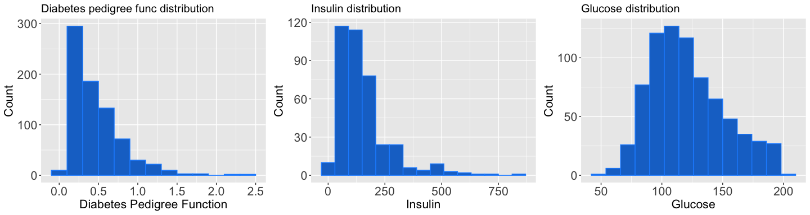
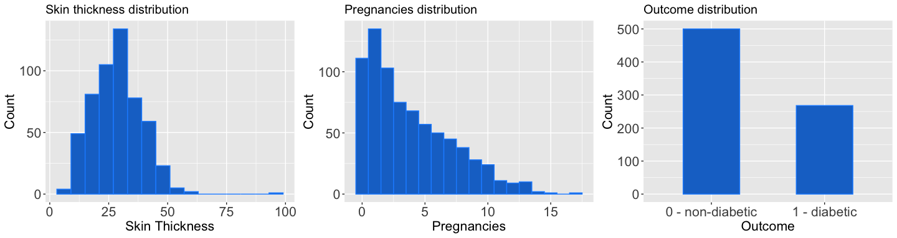
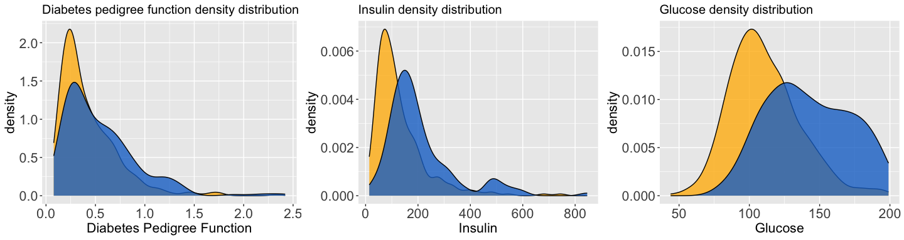
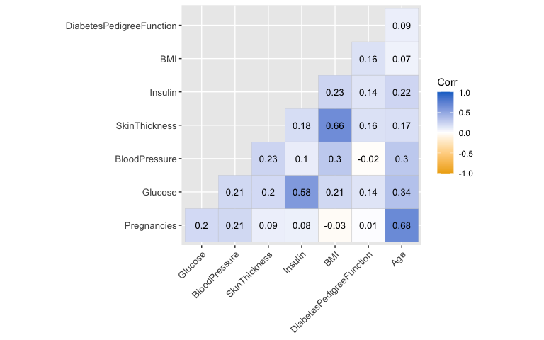

Diabetes prediction using regression analysis in R
================

<br>

### I. Project objective

Blood glucose is regulated by the hormone insulin. When the body cannot
produce enough insulin or is not effectively using the insulin it makes,
there can be too much glucose in the blood which can result to a serious
chronic condition called diabetes. Over time, the excess sugar in the
blood could cause damage to blood vessels and nerves, and may result to
many health complications. Early diagnosis leading to early and optimal
self-management and treatment of diabetes is important to reduce such
risks of diabetes-related complications.

In this regard, this project was aimed at developing a predictive model
using regression analysis for classifying an outcome for a patient as
with or without diabetes based on some diagnostic measurements.

<br>

### II. Exploratory Data Analysis

**A. Data Collection**

The dataset used in this analysis was obtained from Kaggle and which was
originally from the National Institute of Diabetes and Digestive and
Kidney Diseases. The dataset came from a larger database constrained to
instances of patients being females, at least 21 years old and of Prima
Indian heritage.

The dataset has 768 observations and 9 variables indicating patient
diagnostic measurements including the outcome if diabetic or not (target
variable). The variables are:

- `Pregnancies` : number of pregnancies a woman has had, including live
  birth, miscarriage, or stillbirth
- `Glucose` : plasma glucose concentration from a 2-hour oral glucose
  tolerance test
- `BloodPressure` : diastolic blood pressure (mm Hg)
- `SkinThickness` : triceps skinfold thickness (mm)
- `Insulin` : two-hour serum insulin (mu U/ml)
- `BMI` : body mass index
- `DiabetesPedigreeFunction` : risk of developing type 2 diabetes
- `Age` : age
- `Outcome` : is the patient with diabetes or without (1- diabetic, 0-
  non-diabetic)

<br>

**B. Data Exploration**

An initial look at the structure of the dataset (`diabetes_df`)shows:

    ## 'data.frame':    768 obs. of  9 variables:
    ##  $ Pregnancies             : int  6 1 8 1 0 5 3 10 2 8 ...
    ##  $ Glucose                 : int  148 85 183 89 137 116 78 115 197 125 ...
    ##  $ BloodPressure           : int  72 66 64 66 40 74 50 0 70 96 ...
    ##  $ SkinThickness           : int  35 29 0 23 35 0 32 0 45 0 ...
    ##  $ Insulin                 : int  0 0 0 94 168 0 88 0 543 0 ...
    ##  $ BMI                     : num  33.6 26.6 23.3 28.1 43.1 25.6 31 35.3 30.5 0 ...
    ##  $ DiabetesPedigreeFunction: num  0.627 0.351 0.672 0.167 2.288 ...
    ##  $ Age                     : int  50 31 32 21 33 30 26 29 53 54 ...
    ##  $ Outcome                 : int  1 0 1 0 1 0 1 0 1 1 ...

The first 10 records of `diabetes_df`:

    ##    Pregnancies Glucose BloodPressure SkinThickness Insulin  BMI
    ## 1            6     148            72            35       0 33.6
    ## 2            1      85            66            29       0 26.6
    ## 3            8     183            64             0       0 23.3
    ## 4            1      89            66            23      94 28.1
    ## 5            0     137            40            35     168 43.1
    ## 6            5     116            74             0       0 25.6
    ## 7            3      78            50            32      88 31.0
    ## 8           10     115             0             0       0 35.3
    ## 9            2     197            70            45     543 30.5
    ## 10           8     125            96             0       0  0.0
    ##    DiabetesPedigreeFunction Age Outcome
    ## 1                     0.627  50       1
    ## 2                     0.351  31       0
    ## 3                     0.672  32       1
    ## 4                     0.167  21       0
    ## 5                     2.288  33       1
    ## 6                     0.201  30       0
    ## 7                     0.248  26       1
    ## 8                     0.134  29       0
    ## 9                     0.158  53       1
    ## 10                    0.232  54       1

<br>

Summary statistics of the features:

    ##   Pregnancies        Glucose      BloodPressure    SkinThickness  
    ##  Min.   : 0.000   Min.   :  0.0   Min.   :  0.00   Min.   : 0.00  
    ##  1st Qu.: 1.000   1st Qu.: 99.0   1st Qu.: 62.00   1st Qu.: 0.00  
    ##  Median : 3.000   Median :117.0   Median : 72.00   Median :23.00  
    ##  Mean   : 3.845   Mean   :120.9   Mean   : 69.11   Mean   :20.54  
    ##  3rd Qu.: 6.000   3rd Qu.:140.2   3rd Qu.: 80.00   3rd Qu.:32.00  
    ##  Max.   :17.000   Max.   :199.0   Max.   :122.00   Max.   :99.00  
    ##     Insulin           BMI        DiabetesPedigreeFunction      Age       
    ##  Min.   :  0.0   Min.   : 0.00   Min.   :0.0780           Min.   :21.00  
    ##  1st Qu.:  0.0   1st Qu.:27.30   1st Qu.:0.2437           1st Qu.:24.00  
    ##  Median : 30.5   Median :32.00   Median :0.3725           Median :29.00  
    ##  Mean   : 79.8   Mean   :31.99   Mean   :0.4719           Mean   :33.24  
    ##  3rd Qu.:127.2   3rd Qu.:36.60   3rd Qu.:0.6262           3rd Qu.:41.00  
    ##  Max.   :846.0   Max.   :67.10   Max.   :2.4200           Max.   :81.00  
    ##     Outcome     
    ##  Min.   :0.000  
    ##  1st Qu.:0.000  
    ##  Median :0.000  
    ##  Mean   :0.349  
    ##  3rd Qu.:1.000  
    ##  Max.   :1.000

Most of the features are numerical. Though expressed as the binary (0,
1), the target variable `outcome` should be categorical. Moreover, the
minimum value for glucose, blood pressure, skin thickness, insulin and
BMI is zero which is not medically realistic. Hence, the zero values
were replaces with NA’s.

``` r
diabetes_df2 <- diabetes_df %>% 
  mutate(Outcome = as.factor(Outcome)) %>% 
  mutate(Glucose = ifelse(Glucose == 0, NA, Glucose)) %>% 
  mutate(BloodPressure = ifelse(BloodPressure == 0, NA, BloodPressure)) %>%
  mutate(SkinThickness = ifelse(SkinThickness == 0, NA, SkinThickness)) %>%
  mutate(Insulin = ifelse(Insulin == 0, NA, Insulin)) %>%
  mutate(BMI = ifelse(BMI == 0, NA, BMI)) 
```

Checking again the summary statistics:

    ##   Pregnancies        Glucose      BloodPressure    SkinThickness  
    ##  Min.   : 0.000   Min.   : 44.0   Min.   : 24.00   Min.   : 7.00  
    ##  1st Qu.: 1.000   1st Qu.: 99.0   1st Qu.: 64.00   1st Qu.:22.00  
    ##  Median : 3.000   Median :117.0   Median : 72.00   Median :29.00  
    ##  Mean   : 3.845   Mean   :121.7   Mean   : 72.41   Mean   :29.15  
    ##  3rd Qu.: 6.000   3rd Qu.:141.0   3rd Qu.: 80.00   3rd Qu.:36.00  
    ##  Max.   :17.000   Max.   :199.0   Max.   :122.00   Max.   :99.00  
    ##                   NA's   :5       NA's   :35       NA's   :227    
    ##     Insulin            BMI        DiabetesPedigreeFunction      Age       
    ##  Min.   : 14.00   Min.   :18.20   Min.   :0.0780           Min.   :21.00  
    ##  1st Qu.: 76.25   1st Qu.:27.50   1st Qu.:0.2437           1st Qu.:24.00  
    ##  Median :125.00   Median :32.30   Median :0.3725           Median :29.00  
    ##  Mean   :155.55   Mean   :32.46   Mean   :0.4719           Mean   :33.24  
    ##  3rd Qu.:190.00   3rd Qu.:36.60   3rd Qu.:0.6262           3rd Qu.:41.00  
    ##  Max.   :846.00   Max.   :67.10   Max.   :2.4200           Max.   :81.00  
    ##  NA's   :374      NA's   :11                                              
    ##  Outcome
    ##  0:500  
    ##  1:268  
    ##         
    ##         
    ##         
    ##         
    ## 

<br>

**Univariate plots**

Univariate plots are shown below. It can be observed that most of the
distributions are skewed to the right, particularly for age, insulin,
pregnancies and diabetes pedigree function. Among the patients in the
dataset, 268 patients (35%) have diabetes and 500 patients (65%) are
without.


<br>


<br>



<br>

**Density plots based on `Outcome`**

The density plots of each predictor variable differentiating between
diabetic and non-diabetic are shown below:


<br>


<br>


<br>

**Correlation plot**

The figure below shows the correlation among the numeric predictor
variables which mostly are relatively positive. Among the variables
which have quite strong correlation are: (a) skin thickness and BMI; (b)
glucose and insulin; and (c) age and pregnancies (note that the dataset
only includes women aged 21 and above).


<br>

**C. Data pre-processing**

Based on the summary statistics above, the dataset has a number of
missing data, particularly on glucose, blood pressure, skin thickness,
insulin and BMI. To address this, the missing data (zero values in the
original `diabetes_df` dataset) were imputed with the mean value of the
column.

``` r
diabetes_df3 <- diabetes_df %>% 
  mutate(Outcome = as.factor(Outcome)) %>% 
  mutate(Glucose = ifelse(Glucose == 0, mean(Glucose), Glucose)) %>% 
  mutate(BloodPressure = ifelse(BloodPressure == 0, mean(BloodPressure), BloodPressure)) %>%
  mutate(SkinThickness = ifelse(SkinThickness == 0, mean(SkinThickness), SkinThickness)) %>%
  mutate(Insulin = ifelse(Insulin == 0, mean(SkinThickness), Insulin)) %>%
  mutate(BMI = ifelse(BMI == 0, mean(BMI), BMI)) 
```

<br> <br>

### III. Evaluation of Logistic Regression Models

**A. Splitting the dataset**

The dataset was split into training data set (80%) and test data set.
The training data set was used in building the logistic regression
models and the test data set was used in evaluating the final model.

``` r
RNGkind(sample.kind = "Rounding")
set.seed(100)

train_index <-  sample(nrow(diabetes_df3), nrow(diabetes_df3)*0.8)

training_data <- diabetes_df3[train_index, ]
test_data <- diabetes_df3[-train_index, ]
```

``` r
nrow(training_data)
```

    ## [1] 614

``` r
nrow(test_data)
```

    ## [1] 154

<br> <br>

**B. Logistic regression models**

For this analysis, two models were evaluated:

1.  Model 1 - general model including all independent variables
2.  Model 2 - stepwise model

Model results are detailed below

<br>

**Model 1: General model including all independent variables**

This model fits a logistic regression model that relates all 8
independent variables with the target `Outcome` variable.

<div align="center">

P(Outcome = 1) = $\beta_0$ + $\beta_1$Age + $\beta_2$BloodPressure +
$\beta_3$BMI + $\beta_4$DiabetesPedigreeFunction + $\beta_5$Insulin +
$\beta_6$Glucose + $\beta_7$SkinThickness + $\beta_8$Pregnancies +
$\epsilon$

</div>

<br>

``` r
diabetes_logmod_01 <- glm(Outcome~ Age + BloodPressure + BMI + 
                       DiabetesPedigreeFunction + Insulin + Glucose + SkinThickness + Pregnancies, 
                       family = binomial(link = 'logit'), data = training_data)

summary(diabetes_logmod_01)
```

    ## 
    ## Call:
    ## glm(formula = Outcome ~ Age + BloodPressure + BMI + DiabetesPedigreeFunction + 
    ##     Insulin + Glucose + SkinThickness + Pregnancies, family = binomial(link = "logit"), 
    ##     data = training_data)
    ## 
    ## Coefficients:
    ##                            Estimate Std. Error z value Pr(>|z|)    
    ## (Intercept)              -10.126487   0.955690 -10.596  < 2e-16 ***
    ## Age                        0.005600   0.011015   0.508 0.611204    
    ## BloodPressure             -0.002117   0.010147  -0.209 0.834746    
    ## BMI                        0.095238   0.020360   4.678  2.9e-06 ***
    ## DiabetesPedigreeFunction   1.418933   0.366964   3.867 0.000110 ***
    ## Insulin                   -0.002281   0.001027  -2.221 0.026319 *  
    ## Glucose                    0.043283   0.004610   9.388  < 2e-16 ***
    ## SkinThickness             -0.001220   0.013002  -0.094 0.925212    
    ## Pregnancies                0.127910   0.037843   3.380 0.000725 ***
    ## ---
    ## Signif. codes:  0 '***' 0.001 '**' 0.01 '*' 0.05 '.' 0.1 ' ' 1
    ## 
    ## (Dispersion parameter for binomial family taken to be 1)
    ## 
    ##     Null deviance: 798.83  on 613  degrees of freedom
    ## Residual deviance: 546.67  on 605  degrees of freedom
    ## AIC: 564.67
    ## 
    ## Number of Fisher Scoring iterations: 5

<br>

The results can also be presented in terms of odds ratios as in below
table:

<table style="border-collapse:collapse; border:none;">
<tr>
<th style="border-top: double; text-align:center; font-style:normal; font-weight:bold; padding:0.2cm;  text-align:left; ">
 
</th>
<th colspan="3" style="border-top: double; text-align:center; font-style:normal; font-weight:bold; padding:0.2cm; ">
Outcome
</th>
</tr>
<tr>
<td style=" text-align:center; border-bottom:1px solid; font-style:italic; font-weight:normal;  text-align:left; ">
Predictors
</td>
<td style=" text-align:center; border-bottom:1px solid; font-style:italic; font-weight:normal;  ">
Odds Ratios
</td>
<td style=" text-align:center; border-bottom:1px solid; font-style:italic; font-weight:normal;  ">
CI
</td>
<td style=" text-align:center; border-bottom:1px solid; font-style:italic; font-weight:normal;  ">
p
</td>
</tr>
<tr>
<td style=" padding:0.2cm; text-align:left; vertical-align:top; text-align:left; ">
(Intercept)
</td>
<td style=" padding:0.2cm; text-align:left; vertical-align:top; text-align:center;  ">
0.00
</td>
<td style=" padding:0.2cm; text-align:left; vertical-align:top; text-align:center;  ">
0.00 – 0.00
</td>
<td style=" padding:0.2cm; text-align:left; vertical-align:top; text-align:center;  ">
<strong>\<0.001</strong>
</td>
</tr>
<tr>
<td style=" padding:0.2cm; text-align:left; vertical-align:top; text-align:left; ">
Age
</td>
<td style=" padding:0.2cm; text-align:left; vertical-align:top; text-align:center;  ">
1.01
</td>
<td style=" padding:0.2cm; text-align:left; vertical-align:top; text-align:center;  ">
0.98 – 1.03
</td>
<td style=" padding:0.2cm; text-align:left; vertical-align:top; text-align:center;  ">
0.611
</td>
</tr>
<tr>
<td style=" padding:0.2cm; text-align:left; vertical-align:top; text-align:left; ">
BloodPressure
</td>
<td style=" padding:0.2cm; text-align:left; vertical-align:top; text-align:center;  ">
1.00
</td>
<td style=" padding:0.2cm; text-align:left; vertical-align:top; text-align:center;  ">
0.98 – 1.02
</td>
<td style=" padding:0.2cm; text-align:left; vertical-align:top; text-align:center;  ">
0.835
</td>
</tr>
<tr>
<td style=" padding:0.2cm; text-align:left; vertical-align:top; text-align:left; ">
BMI
</td>
<td style=" padding:0.2cm; text-align:left; vertical-align:top; text-align:center;  ">
1.10
</td>
<td style=" padding:0.2cm; text-align:left; vertical-align:top; text-align:center;  ">
1.06 – 1.15
</td>
<td style=" padding:0.2cm; text-align:left; vertical-align:top; text-align:center;  ">
<strong>\<0.001</strong>
</td>
</tr>
<tr>
<td style=" padding:0.2cm; text-align:left; vertical-align:top; text-align:left; ">
DiabetesPedigreeFunction
</td>
<td style=" padding:0.2cm; text-align:left; vertical-align:top; text-align:center;  ">
4.13
</td>
<td style=" padding:0.2cm; text-align:left; vertical-align:top; text-align:center;  ">
2.03 – 8.56
</td>
<td style=" padding:0.2cm; text-align:left; vertical-align:top; text-align:center;  ">
<strong>\<0.001</strong>
</td>
</tr>
<tr>
<td style=" padding:0.2cm; text-align:left; vertical-align:top; text-align:left; ">
Insulin
</td>
<td style=" padding:0.2cm; text-align:left; vertical-align:top; text-align:center;  ">
1.00
</td>
<td style=" padding:0.2cm; text-align:left; vertical-align:top; text-align:center;  ">
1.00 – 1.00
</td>
<td style=" padding:0.2cm; text-align:left; vertical-align:top; text-align:center;  ">
<strong>0.026</strong>
</td>
</tr>
<tr>
<td style=" padding:0.2cm; text-align:left; vertical-align:top; text-align:left; ">
Glucose
</td>
<td style=" padding:0.2cm; text-align:left; vertical-align:top; text-align:center;  ">
1.04
</td>
<td style=" padding:0.2cm; text-align:left; vertical-align:top; text-align:center;  ">
1.04 – 1.05
</td>
<td style=" padding:0.2cm; text-align:left; vertical-align:top; text-align:center;  ">
<strong>\<0.001</strong>
</td>
</tr>
<tr>
<td style=" padding:0.2cm; text-align:left; vertical-align:top; text-align:left; ">
SkinThickness
</td>
<td style=" padding:0.2cm; text-align:left; vertical-align:top; text-align:center;  ">
1.00
</td>
<td style=" padding:0.2cm; text-align:left; vertical-align:top; text-align:center;  ">
0.97 – 1.02
</td>
<td style=" padding:0.2cm; text-align:left; vertical-align:top; text-align:center;  ">
0.925
</td>
</tr>
<tr>
<td style=" padding:0.2cm; text-align:left; vertical-align:top; text-align:left; ">
Pregnancies
</td>
<td style=" padding:0.2cm; text-align:left; vertical-align:top; text-align:center;  ">
1.14
</td>
<td style=" padding:0.2cm; text-align:left; vertical-align:top; text-align:center;  ">
1.06 – 1.23
</td>
<td style=" padding:0.2cm; text-align:left; vertical-align:top; text-align:center;  ">
<strong>0.001</strong>
</td>
</tr>
<tr>
<td style=" padding:0.2cm; text-align:left; vertical-align:top; text-align:left; padding-top:0.1cm; padding-bottom:0.1cm; border-top:1px solid;">
Observations
</td>
<td style=" padding:0.2cm; text-align:left; vertical-align:top; padding-top:0.1cm; padding-bottom:0.1cm; text-align:left; border-top:1px solid;" colspan="3">
614
</td>
</tr>
</table>

<br>

**Model 2 - stepwise model**

This model automatically selects a reduced number of (relevant)
predictor variables for building the logistic regression model.

``` r
diabetes_logmod_02 <- step(diabetes_logmod_01, direction = "backward", trace = 0)

summary(diabetes_logmod_02)
```

    ## 
    ## Call:
    ## glm(formula = Outcome ~ BMI + DiabetesPedigreeFunction + Insulin + 
    ##     Glucose + Pregnancies, family = binomial(link = "logit"), 
    ##     data = training_data)
    ## 
    ## Coefficients:
    ##                            Estimate Std. Error z value Pr(>|z|)    
    ## (Intercept)              -1.011e+01  8.500e-01 -11.894  < 2e-16 ***
    ## BMI                       9.234e-02  1.716e-02   5.381 7.41e-08 ***
    ## DiabetesPedigreeFunction  1.421e+00  3.669e-01   3.872 0.000108 ***
    ## Insulin                  -2.320e-03  9.943e-04  -2.333 0.019625 *  
    ## Glucose                   4.368e-02  4.481e-03   9.746  < 2e-16 ***
    ## Pregnancies               1.373e-01  3.199e-02   4.294 1.76e-05 ***
    ## ---
    ## Signif. codes:  0 '***' 0.001 '**' 0.01 '*' 0.05 '.' 0.1 ' ' 1
    ## 
    ## (Dispersion parameter for binomial family taken to be 1)
    ## 
    ##     Null deviance: 798.83  on 613  degrees of freedom
    ## Residual deviance: 546.94  on 608  degrees of freedom
    ## AIC: 558.94
    ## 
    ## Number of Fisher Scoring iterations: 5

<br>

Similarly, the results can also be presented in terms of odds ratios as
in below table:

<table style="border-collapse:collapse; border:none;">
<tr>
<th style="border-top: double; text-align:center; font-style:normal; font-weight:bold; padding:0.2cm;  text-align:left; ">
 
</th>
<th colspan="3" style="border-top: double; text-align:center; font-style:normal; font-weight:bold; padding:0.2cm; ">
Outcome
</th>
</tr>
<tr>
<td style=" text-align:center; border-bottom:1px solid; font-style:italic; font-weight:normal;  text-align:left; ">
Predictors
</td>
<td style=" text-align:center; border-bottom:1px solid; font-style:italic; font-weight:normal;  ">
Odds Ratios
</td>
<td style=" text-align:center; border-bottom:1px solid; font-style:italic; font-weight:normal;  ">
CI
</td>
<td style=" text-align:center; border-bottom:1px solid; font-style:italic; font-weight:normal;  ">
p
</td>
</tr>
<tr>
<td style=" padding:0.2cm; text-align:left; vertical-align:top; text-align:left; ">
(Intercept)
</td>
<td style=" padding:0.2cm; text-align:left; vertical-align:top; text-align:center;  ">
0.00
</td>
<td style=" padding:0.2cm; text-align:left; vertical-align:top; text-align:center;  ">
0.00 – 0.00
</td>
<td style=" padding:0.2cm; text-align:left; vertical-align:top; text-align:center;  ">
<strong>\<0.001</strong>
</td>
</tr>
<tr>
<td style=" padding:0.2cm; text-align:left; vertical-align:top; text-align:left; ">
BMI
</td>
<td style=" padding:0.2cm; text-align:left; vertical-align:top; text-align:center;  ">
1.10
</td>
<td style=" padding:0.2cm; text-align:left; vertical-align:top; text-align:center;  ">
1.06 – 1.14
</td>
<td style=" padding:0.2cm; text-align:left; vertical-align:top; text-align:center;  ">
<strong>\<0.001</strong>
</td>
</tr>
<tr>
<td style=" padding:0.2cm; text-align:left; vertical-align:top; text-align:left; ">
DiabetesPedigreeFunction
</td>
<td style=" padding:0.2cm; text-align:left; vertical-align:top; text-align:center;  ">
4.14
</td>
<td style=" padding:0.2cm; text-align:left; vertical-align:top; text-align:center;  ">
2.03 – 8.57
</td>
<td style=" padding:0.2cm; text-align:left; vertical-align:top; text-align:center;  ">
<strong>\<0.001</strong>
</td>
</tr>
<tr>
<td style=" padding:0.2cm; text-align:left; vertical-align:top; text-align:left; ">
Insulin
</td>
<td style=" padding:0.2cm; text-align:left; vertical-align:top; text-align:center;  ">
1.00
</td>
<td style=" padding:0.2cm; text-align:left; vertical-align:top; text-align:center;  ">
1.00 – 1.00
</td>
<td style=" padding:0.2cm; text-align:left; vertical-align:top; text-align:center;  ">
<strong>0.020</strong>
</td>
</tr>
<tr>
<td style=" padding:0.2cm; text-align:left; vertical-align:top; text-align:left; ">
Glucose
</td>
<td style=" padding:0.2cm; text-align:left; vertical-align:top; text-align:center;  ">
1.04
</td>
<td style=" padding:0.2cm; text-align:left; vertical-align:top; text-align:center;  ">
1.04 – 1.05
</td>
<td style=" padding:0.2cm; text-align:left; vertical-align:top; text-align:center;  ">
<strong>\<0.001</strong>
</td>
</tr>
<tr>
<td style=" padding:0.2cm; text-align:left; vertical-align:top; text-align:left; ">
Pregnancies
</td>
<td style=" padding:0.2cm; text-align:left; vertical-align:top; text-align:center;  ">
1.15
</td>
<td style=" padding:0.2cm; text-align:left; vertical-align:top; text-align:center;  ">
1.08 – 1.22
</td>
<td style=" padding:0.2cm; text-align:left; vertical-align:top; text-align:center;  ">
<strong>\<0.001</strong>
</td>
</tr>
<tr>
<td style=" padding:0.2cm; text-align:left; vertical-align:top; text-align:left; padding-top:0.1cm; padding-bottom:0.1cm; border-top:1px solid;">
Observations
</td>
<td style=" padding:0.2cm; text-align:left; vertical-align:top; padding-top:0.1cm; padding-bottom:0.1cm; text-align:left; border-top:1px solid;" colspan="3">
614
</td>
</tr>
</table>

<br>

**C. Comparing the models**

In terms of the residual deviance, Model 1 and Model 2 do not differ
much. However, Model 2 has slightly lower AIC (558.94) compared to Model
1 (564.67) which makes Model 2 the better-fit model. Moreover, looking
at the odds ratio tables, the variables which were excluded in Model 2
have odd ratios of 1.0 and high p-value (\>0.05) meaning no association
between these variables (age, blood pressure, skin thickness) and the
outcome variable. Also, these variables were identified in the
correlation plot as having quite strong correlations with the other
variables (age, BMI). Excluding them in the model lessens
multicollinearity (or possibility of it) which is better for a
regression model.

<br>

**D. Predicting from test data**

The performance of Model 2 on new data was evaluated using the test
data. Predicted values for `Outcome` were obtained as below:

``` r
test_data$prediction <- predict(diabetes_logmod_02, newdata = test_data, type = "response")
test_data$pred_diabetic <- ifelse(test = test_data$prediction > 0.5, yes = "1", no = "0")
test_data <- test_data %>% 
  mutate(pred_diabetic = as.factor(pred_diabetic))
```

<br>

**Confusion Matrix**

A confusion matrix with the predicted and known `Outcome` values of the
test data set is presented below, showing an accuracy of 0.74.

    ## Confusion Matrix and Statistics
    ## 
    ##           Reference
    ## Prediction  0  1
    ##          0 88 25
    ##          1 16 25
    ##                                           
    ##                Accuracy : 0.7338          
    ##                  95% CI : (0.6566, 0.8017)
    ##     No Information Rate : 0.6753          
    ##     P-Value [Acc > NIR] : 0.06998         
    ##                                           
    ##                   Kappa : 0.3631          
    ##                                           
    ##  Mcnemar's Test P-Value : 0.21152         
    ##                                           
    ##             Sensitivity : 0.5000          
    ##             Specificity : 0.8462          
    ##          Pos Pred Value : 0.6098          
    ##          Neg Pred Value : 0.7788          
    ##              Prevalence : 0.3247          
    ##          Detection Rate : 0.1623          
    ##    Detection Prevalence : 0.2662          
    ##       Balanced Accuracy : 0.6731          
    ##                                           
    ##        'Positive' Class : 1               
    ## 


<br>

**ROC Curve and AUC**

The ROC (receiver operating characteristic) curve plots the sensitivity
and specificity of a model. The ROC curve for Model 2 is shown below. It
also indicates the AUC (area under the curve) which evaluates how well
this logistic regression model classifies the `Outcomes` outcomes based
on the set cutoff (0.5). A high AUC means the model is better at
predicting non-diabetic (0 classes as 0) and diabetic (1 classes as 1).
Model 2 resulted to a moderately good AUC of 0.788.


    ## Area under the curve: 0.7875

<br> <br>

### IV. Insights

In this project, a logistic regression model was developed to predict if
a patient is diabetic or not. Among the two models evaluated, Model 2
with reduced predictor variables has the better fit in classifying the
`Outcome`.

From Model 2 results, holding other variables at fixed value: (a) a unit
increase in glucose concentration increases the odds of the patient
being diabetic by 4%; (b) a new pregnancy increases the odds of the
patient being diabetic by 15%; (c) an increase in BMI increases the odds
of a patient being diabetic by 10%; and a unit increase in the diabetes
pedigree function score increases the odds of a patient being diabetic
by a factor of 4.14 (or 4 times). Insulin has an odds ration of 1.0
which means no association with the outcome.

Based on the obtained AUC, the model has 79%% chance of distinguishing a
patient as diabetic (1 class) or not (0 class). The dataset seemed not
large enough and hence, additional observations (data) might improve the
model.

<br> <br> <br>
